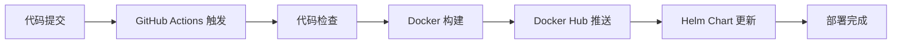

# 🚀 GitHub Actions 完整自动化部署

## 自动化流程



---

## 快速开始

### 1️⃣ 创建 GitHub 仓库

**方式 A: 自动创建 (推荐)**

```bash
# 获取 GitHub Personal Access Token
# https://github.com/settings/tokens

export GITHUB_TOKEN=your_token_here
chmod +x auto-create-repo.sh
./auto-create-repo.sh
```

**方式 B: 手动创建**

1. 访问 https://github.com/new
2. 仓库名：`health-mgmt`
3. Visibility: Public 或 Private
4. 不要勾选 Add README

### 2️⃣ 配置 Docker Hub Secrets

```
访问：https://github.com/laobanliu62-design/health-mgmt/settings/secrets/actions
```

**添加以下 Secrets:**

| Secret Name | Value |
|-------------|-------|
| `DOCKER_USERNAME` | 你的 Docker Hub 用户名 |
| `DOCKER_PASSWORD` | Docker Hub Access Token |

**获取 Docker Hub Access Token:**
1. https://hub.docker.com → Account Settings
2. Security → Access Tokens
3. Generate Token
4. 复制 Token 备用

### 3️⃣ 首次推送

```bash
cd ~/health-management
git add .
git commit -m "feat: Initial commit with CI/CD"
git push -u origin main
```

---

## 工作流说明

### Job 1: test
- ✅ Dart 静态分析
- ✅ 运行测试用例
- ❌ 失败则停止后续步骤

### Job 2: build-and-push
- ✅ Docker Buildx (BuildKit)
- ✅ 多阶段构建
- ✅ 自动标签策略:
  - `latest` (main 分支)
  - `branch-<name>` (开发分支)
  - `<sha>` (commit SHA)

### Job 3: update-helm
- ✅ 自动更新 Helm Chart
- ✅ 版本号同步
- ✅ Git commit 和 push

### Job 4: notify
- ✅ 构建状态通知
- ✅ 镜像信息记录

---

## 自动化标签策略

| 触发条件 | 生成的镜像标签 |
|----------|---------------|
| push main | `latest`, `main`, `<sha>` |
| push develop | `develop`, `<sha>` |
| PR 合并 | `<sha>` |

**示例镜像**:
```
docker.io/health-mgmt:latest
docker.io/health-mgmt:main
docker.io/health-mgmt:abc123def
```

---

## 验证部署

### 1. 查看工作流运行

```bash
# 访问 GitHub Actions
https://github.com/laobanliu62-design/health-mgmt/actions

# 查看最新运行状态
# 应看到 "Docker Build and Push" 工作流
```

### 2. 验证镜像

```bash
# 拉取镜像
docker pull laobanliu62-design/health-mgmt:latest

# 查看镜像信息
docker images health-mgmt

# 运行容器
docker run -d -p 8080:80 laobanliu62-design/health-mgmt:latest

# 访问应用
curl http://localhost:8080
```

### 3. 验证 Helm Chart

```bash
# 查看更新后的 values.yaml
cat helm/health-mgmt/values.yaml | grep tag
```

---

## 故障排查

### 问题 1: Docker Hub 登录失败

**症状**: `denied: requested access to the resource is denied`

**解决**:
1. 检查 DOCKER_USERNAME 和 DOCKER_PASSWORD 是否正确
2. 确认使用 Access Token 而非密码
3. 重新生成 Token 并更新 Secrets

### 问题 2: 构建超时

**症状**: `Build timeout after 60 minutes`

**解决**:
1. 检查 .dockerignore 排除大文件
2. 减少构建层数
3. 增加工作流超时时间

### 问题 3: 推送失败

**症状**: `permission denied`

**解决**:
1. 确认 Docker Hub 仓库权限
2. 检查 DOCKER_PASSWORD 是否为 Token
3. 确认用户名正确

---

## 最佳实践

### 1. 分支策略

```
main      → 生产环境
develop   → 开发环境
feature/* → 功能分支
```

### 2. 版本管理

```yaml
# values.yaml
image:
  tag: latest  # 自动更新为 commit SHA
```

### 3. 安全配置

- ✅ 使用 Secrets 管理敏感信息
- ✅ 限制仓库可见性
- ✅ 启用分支保护
- ✅ 审核 Actions 权限

---

## 下一步优化

### 短期
- [ ] 添加代码覆盖率报告
- [ ] 配置 Docker Hub 自动清理
- [ ] 添加通知 (Slack/Telegram)

### 中期
- [ ] 多架构支持 (amd64/arm64)
- [ ] 自动发布到 Helm Repository
- [ ] 集成部署到 K8s

### 长期
- [ ] GitOps 工作流
- [ ] 镜像漏洞扫描
- [ ] 自动回滚策略

---

**配置完成！准备开始自动化之旅！** 🎉
